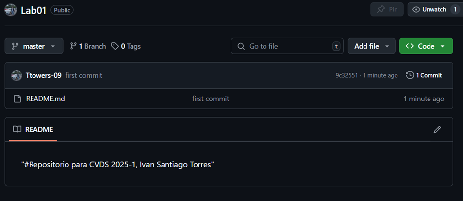
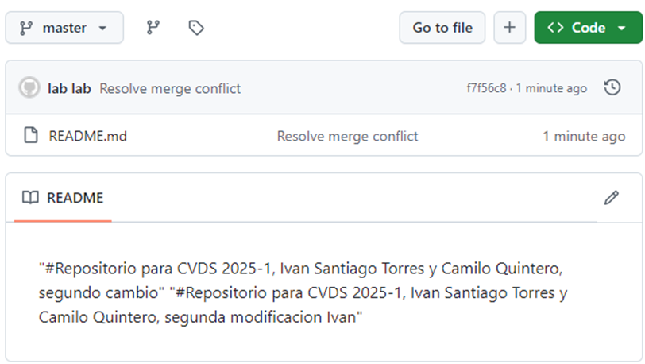

**UNIVERSIDAD ESCUELA COLOMBIANA DE INGENIERÍA JULIO GARAVITO**

**INTEGRANTES**

**Nombres:** Camilo Andres Quintero Rodriguez e Ivan Santiago F. Torres

**Asignacion:** Laboratorio 1 (Introducción a GIT)

**Asignatura:** Ciclos de Vida del desarrollo (CVDS)

**Docente:** Oscar David Ospina Rodriguez.

**RESPUESTAS**

**PARTE I (Trabajo Individual) Camilo Quintero**

1.  Crea un repositorio localmente.

    

2.  Agrega un archivo de ejemplo al repositorio, el README.md puede ser una gran opción.

    
    

3.  Averigua para qué sirve y cómo se usan estos comandos git add y git commit -m "mensaje"

    - Git add nos sirve para agregar archivos nuevos o modificados en nuestro directorio de trabajo al área de preparación de Git

    - git commit -m genera una instancia que nos ayuda a registrar los cambios realizados en el repositorio local.

4.  Abre una cuenta de github, si ya la tienes, enlazarla con el correo
    

5.  Crea un repositorio en blanco (vacío) en GitHub.

    > [[https://github.com/CamiloQuinteroR/lab01CVDS2025_1.git]](https://github.com/CamiloQuinteroR/lab01CVDS2025_1.git)

6.  Configura el repositorio local con el repositorio remoto.

    

7.  Sube los cambios, teniendo en cuenta lo que averiguaste en el punto 3 Utiliza los siguientes comando en el directorio donde tienes tu proyecto, en este orden:

  
    

    > git add .

    >git commit -m \"mensaje, lo que hiciste con el archivo\"

    > git push \"url repositorio\"

8.  Configura el correo en git local de manera correcta

    Se configuró el correo institucional en git

9.  Vuelve a subir los cambios y observa que todo esté bien en el repositorio remoto (en GitHub).

    

    Se realizaron los cambios y todo esta bien en el repositorio remoto.

**PARTE I (Trabajo Individual) Ivan F. Torres**

1.  Crea un repositorio localmente.

    Navegamos por nuestro escritorio y creamos la carpeta.
    
    
    
    Inicializamos nuestro repositorio.

    

2.  Agrega un archivo de ejemplo al repositorio, el README.md puede ser una gran opción.

    Agregamos un elemento README.md
    

3.  Averigua para qué sirve y cómo se usan estos comandos git add y git commit -m "mensaje"

    >- **Git add** nos sirve para agregar archivos nuevos o modificados en nuestro directorio de trabajo al área de preparación de Git

    >- **git commit** -m prepara todos los archivos

4.  Abre una cuenta de github, si ya la tienes, enlazarla con el correo institucional.

    

5.  Crea un repositorio en blanco (vacío) en GitHub.

    

6.  Configura el repositorio local con el repositorio remoto.  
    

7.  Sube los cambios, teniendo en cuenta lo que averiguaste en el punto 3 Utiliza los siguientes comando en el directorio donde tienes tu proyecto, en este orden:

    a.  git add .

    b.  git commit -m \"mensaje, lo que hiciste con el archivo\"

    c.  git push \"url repositor

    

8.  Configura el correo en git local de manera correcta

9.  Vuelve a subir los cambios y observa que todo esté bien en el repositorio remoto (en GitHub).

    

**Parte II (Trabajo en parejas)**

1.  Se escogen los roles para trabajar en equipo, una persona debe escoger ser \"Owner\" o Propietario del repositorio y la otra \"Collaborator\" o Colaborador en el repositorio.

    Ivan: Owner

    Camilo: Collaborator

    "Para el trabajo en equipo decidimos cambiar el nombre del repositorio
    para continuar utilizando de manera conjunta el repositorio"

    

2.  El owner agrega al colaborador con permisos de escritura en el repositorio que creó en la parte 1.
Invitar colaboradores a un repositorio personal.
    
    

3.  El owner le comparte la url via Teams al colaborador

    

4.  El colaborador acepta la invitación al repositorio

    

5.  Owner y Colaborador editan el archivo README.md al mismo tiempo e intentan subir los cambios al mismo tiempo.

    El owner edita el archivo:
    

     El colaborador edita el archivo readme.md
    
    
    El colaborador intenta subir los cambios
    

6.  ¿Qué sucedió?

    Arroja un error con respecto a la modificación realizada por el colaborador.

7.  La persona que perdió la competencia de subir los cambios, tiene que
    resolver los conflictos, cuando haces pull de los cambios, los
    archivos tienen los símbolos \<\<\< === y  (son normales en
    la resolución de conflictos), estos conflictos debes resolverlos
    manualmente.

    

    

8.  Volver a repetir un cambio sobre el README.md ambas personas al tiempo para volver a tener conflictos.

    Cambio realizado por el colaborador
    

    Cambio realizado por el owner

    

    Owner realiza los cambios

    

    Cuando el colaborador intenta subir la modificación se genera el conflicto

    

9.  Resuelvan el conflicto con IntelliJ si es posible, Resolver conflictos en IntelliJ

    

    Subimos los cambios corregidos

    
    

    De esta forma ya sabes resolver conflictos directamente sobre los archivos y usando un IDE como IntelliJ, esto te será muy útil en los futuros trabajos en equipo con Git.

**PARTE III (Trabajo de a parejas)**

1.  ¿Hay una mejor forma de trabajar con git para no tener conflictos?
    Si, pues podemos trabajar con ramas separadas, esto nos ayuda a evitar conflictos, gracias a que cada miembro del equipo puede trabajar sin interferir con el trabajo de los demás.

2.  ¿Qué es y cómo funciona el Pull Request?

    Las solicitudes de incorporación de cambios son un mecanismo para que los desarrolladores notifiquen a los miembros de su equipo que han terminado una función. Una vez la rama de función está lista, el desarrollador realiza la solicitud de incorporación de cambios mediante su cuenta. Así, todas las personas involucradas saben que deben revisar el código y fusionarlo con la rama main.

3.  Creen una rama cada uno y suban sus cambios

    

    Owner crea su rama

    
    
    Colaborador crea su rama

    
    

    Colaborador
    
    
    
    

    Cambios realizados en la rama del colaborador
    

    Ahora el owner sube sus cambios a su rama
    
    

    Verificamos que tanto owner como colaborador estén haciendo el proceso a la par:
    

4.  Tanto owner como colaborador hacen un cambio en el README.md y hacen un Pull Request (PR) a la rama main/master.

    Luego de dar click en el banner amarillo se despliega lo siguiente:
    
    
    

    Luego de darle click en merge Pull request al owner le salió asi:
    
    
    y al colaborador le salió de la siguiente manera:
    
    
    El colaborador debe resolver los conflictos:

(Recomendación : deben trabajar en equipo y distribuirse de mejor manera
quien va a modificar qué, para evitar modificar los mismos archivos al
mismo tiempo, si no se editan los mismos archivos la resolución de
conflictos es automática)

5. Teniendo en cuenta la recomendación, mezclen los cambios a la rama main a través de PR con el check/review/approval del otro compañero (Cuando se hace merge se deberían borrar las ramas en github)

    
    
    
    
    

    Se corrigieron los cambios y se decidió dejar únicamente los cambios del colaborador.

    

    Se realiza nuevamente el pull request después de solucionar los conflictos

    

    Se eliminó la rama de colaborador después de subir los cambios.

    La ultima actualización del readme con respecto al laboratorio fue el siguiente fragmento de texto:
    
"#Repositorio para CVDS 2025-1, Ivan Santiago Torres y Camilo Quintero, segundo cambio" 
"#Repositorio para CVDS 2025-1, Ivan Santiago Torres y Camilo Quintero, segunda modificacion Ivan"
"Cambio tercera parte Camilo Quintero"

**WEBGRAFIA:**

- Atlassian. (s/f). *Pull-requests*. Atlassian. Recuperado el 26 de enero de 2025, de https://www.atlassian.com/es/git/tutorials/making-a-pull-request

