**UNIVERSIDAD ESCUELA COLOMBIANA DE INGENIERÍA JULIO GARAVITO**

**INTEGRANTES**

**Nombres:** Camilo Andres Quintero Rodriguez e Ivan Santiago F. Torres

**Asignacion:** Laboratorio 2 (Patterns)

**Asignatura:** Ciclos de Vida del desarrollo (CVDS)

**Docente:** Oscar David Ospina Rodriguez.

**RESPUESTAS:**

**PRE-RREQUISITOS**

0. Verificamos que los dispositivos cuente con maven instalado para poder trabajar.
    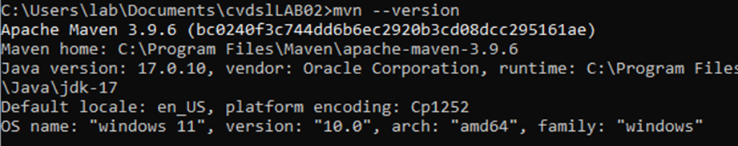

**EJERCICIO DE LAS FIGURAS**

1. Buscar cómo se crea un proyecto maven con ayuda de los arquetipos (archetypes).

    

2. Busque cómo ejecutar desde línea de comandos el objetivo "generate" del plugin "archetype", con los siguientes parámetros:

    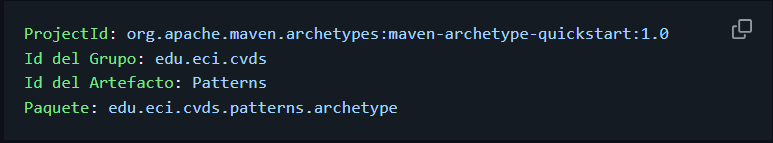
    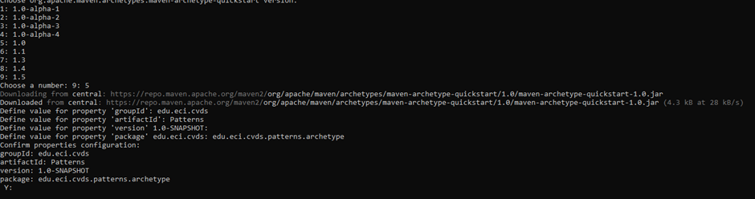
    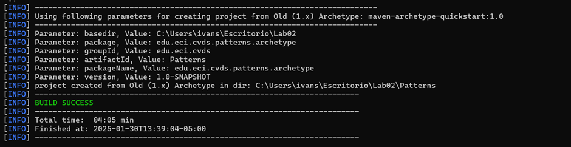

3. Se debió haber creado en el directorio, un nuevo proyecto Patterns a partir de un modelo o arquetipo, que crea un conjunto de directorios con un conjunto de archivos básicos.

    

4. Cambie al directorio Patterns y para ver el conjunto de archivos y directorios creados por el comando mvn, ejecute el comando tree.

    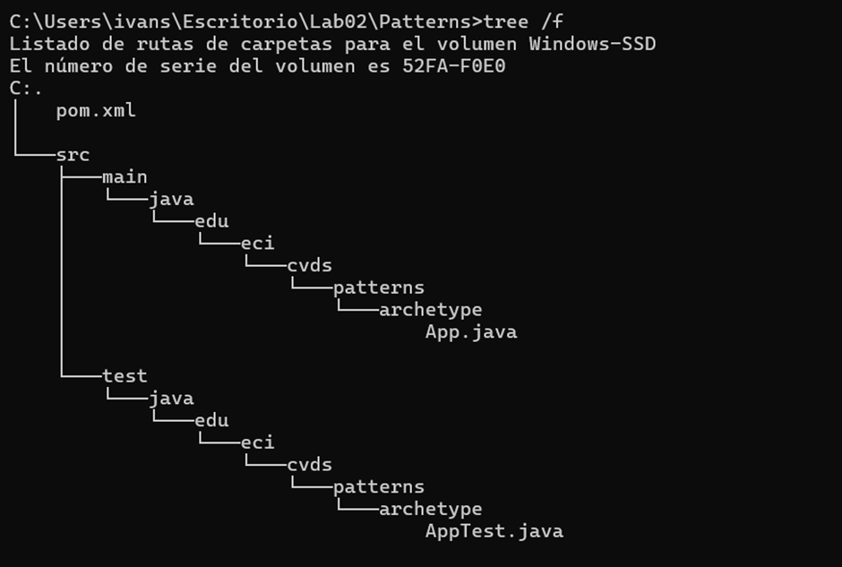

**AJUSTAR ALGUUNAS CONFIGURACIONES EN EL PROYECTO**

5. Edite el archivo pom.xml y realize la siguiente actualización:
- hay que cambiar la versión del compilador de java a la versión 8, para ello, agregue la sección properties antes de la selección de dependencias:

    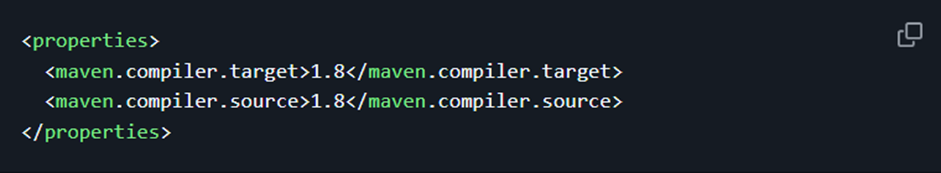

- Código modificado:

    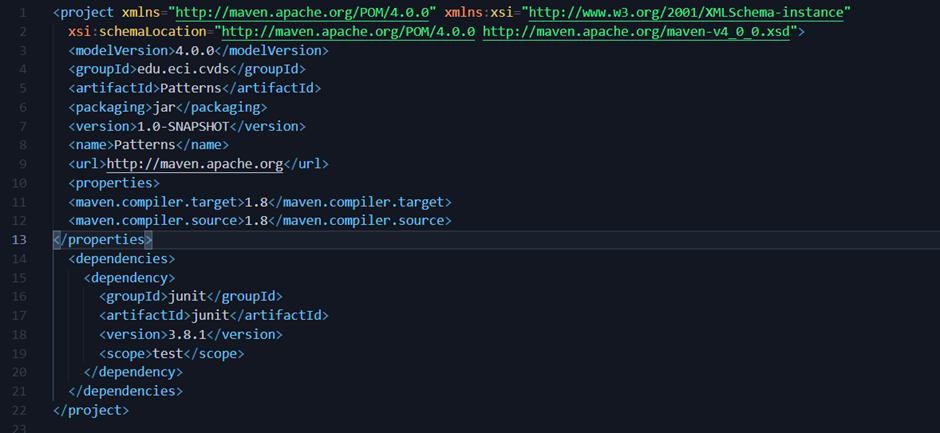

**COMPILAR Y EJECUTAR**

6. Para compilar ejecute el siguiente comando:
    > $ mvn package

    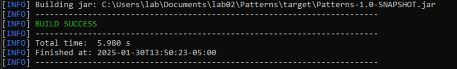

- Verificaremos que se hallan realizado los cambios:

    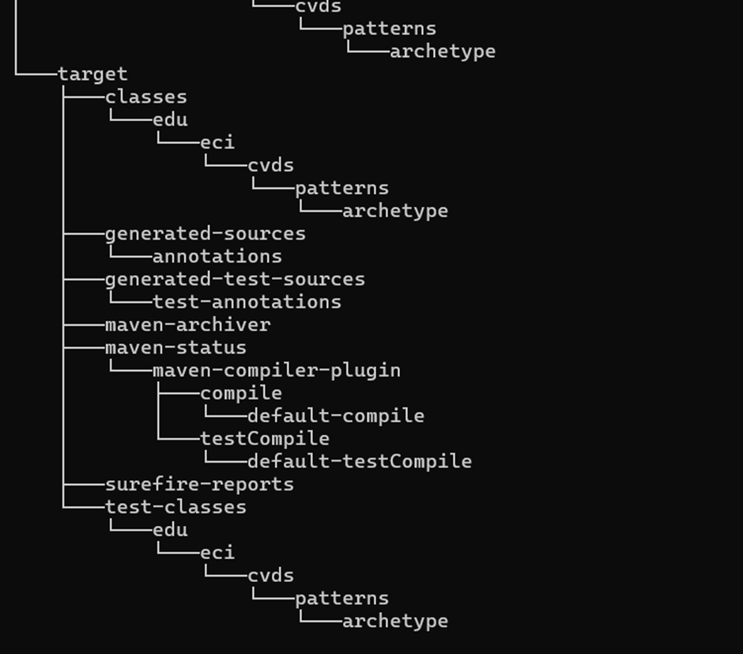

7. Busque cuál es el objetivo del parámetro "packahe" y que otros parámetros se podrían enviar al comando mvn.

- El parámetro **"package"** se usa para compilar el código fuente, ejecutar pruebas y empaquetar el proyecto en un archivo distribuible, como en un archivo .jar o .war en el directorio target.
- Otros parámetros que se podrían enviar al comando mvn son:
    - **mvn clean install:** Elimina la carpeta de destino, compila el proyecto, ejecuta pruebas, lo empaquetará y lo agregará al repositorio local.
    -**mvn test:** Válida el proyecto, cómpila el código fuente y ejecuta las pruebas unitarias.
    -**mvn package:** Compila el proyecto y empaqueta el código compilado junto con todos los recursos en un archivo JAR.
    -**mvn archetype:create:** Crea un proyecto desde cero.
    -**mvn compile:** Compila un proyecto.
    -**mvn install:** Instala un proyecto en el repositorio local.
    -**mvn site:site** Genera un sitio para el proyecto.

8. Busque cómo ejecutar desde línea de comandos, un proyecto maven y verifique la salida cuando se ejecuta con la clase App.java como parámetro "mainClass"
- Agregamos el Plugin:

    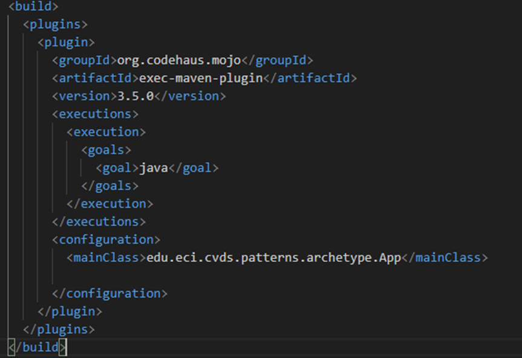

- Ejecutamos el código, se verá de la siguiente manera:

    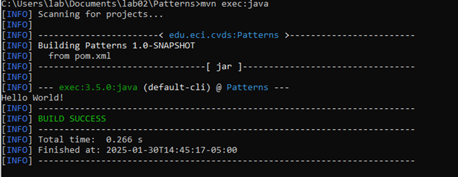

9. Realice el cambio en la clase App.java para crear un saludo personalizado, basado en los parámetros de entrada en la aplicación:

    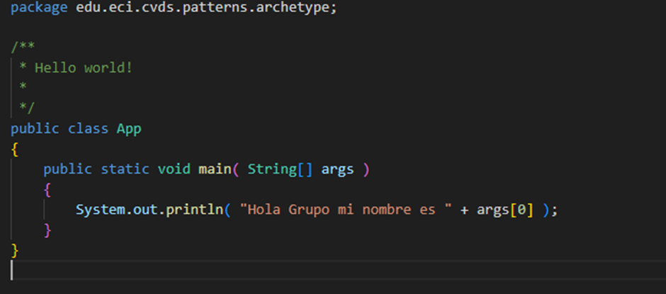

- Se verá de la siguiente manera:

    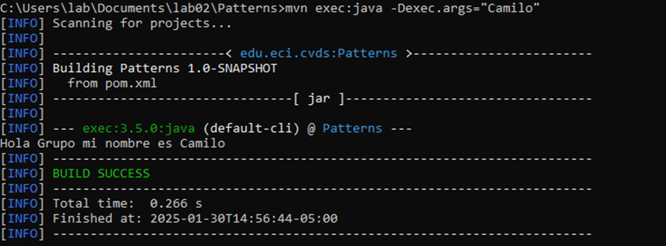 

10. Utilizar la primera posición del parámetro que llega al método "main" para realizar el saludo personalizado, en caso que no sea posible, se debe mantener el saludo como se encuentra actualmente:

    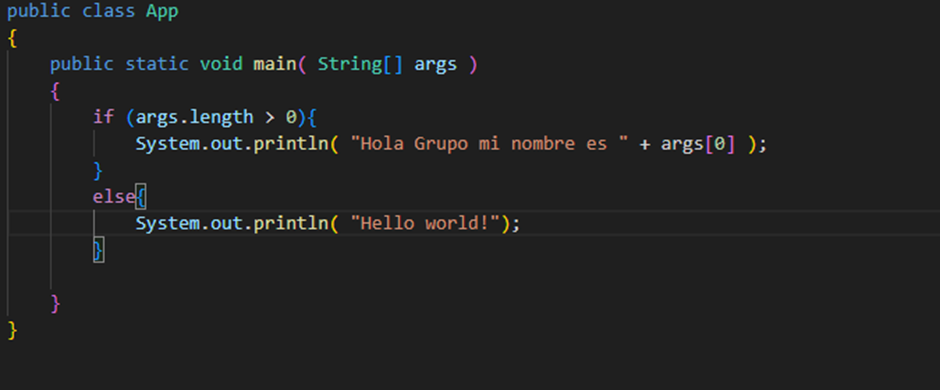

- Se verá de la siguiente manera:

    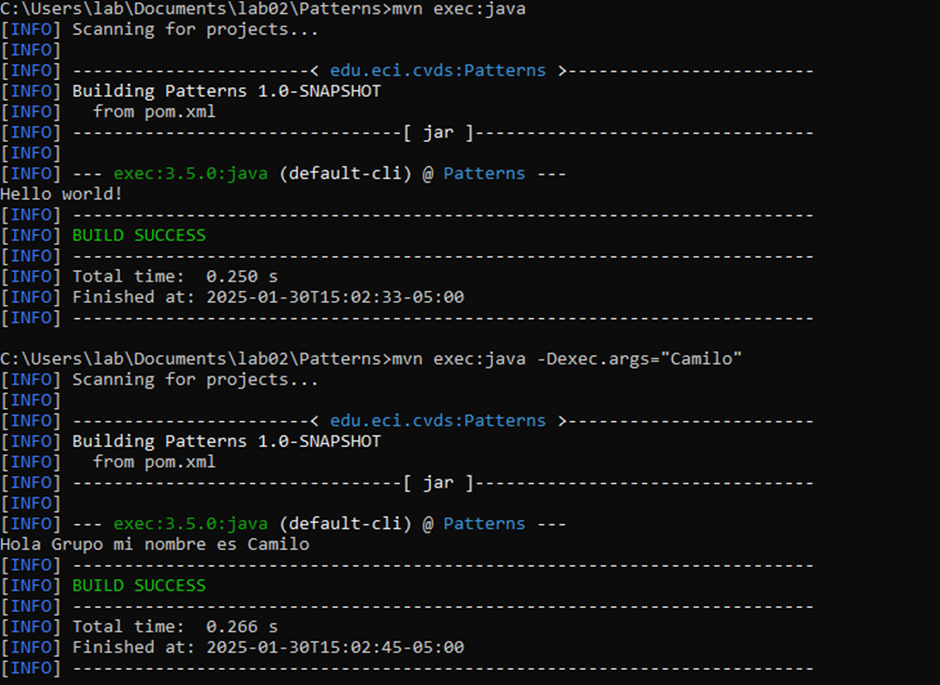

11. Busca cómo enviar parámetros al plugin "exec"

    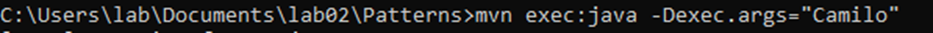

12. Ejecutar nuevamente la clase desde línea de comandos y verificar la salida: Hello World!

- Sin parámetro:

    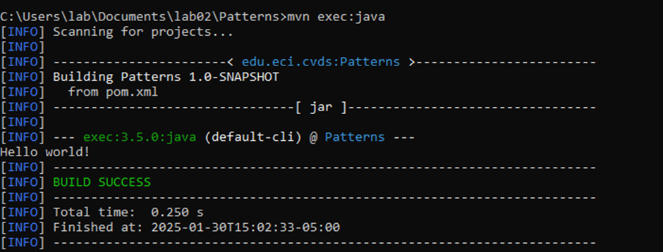

- Con parámetro definido:

    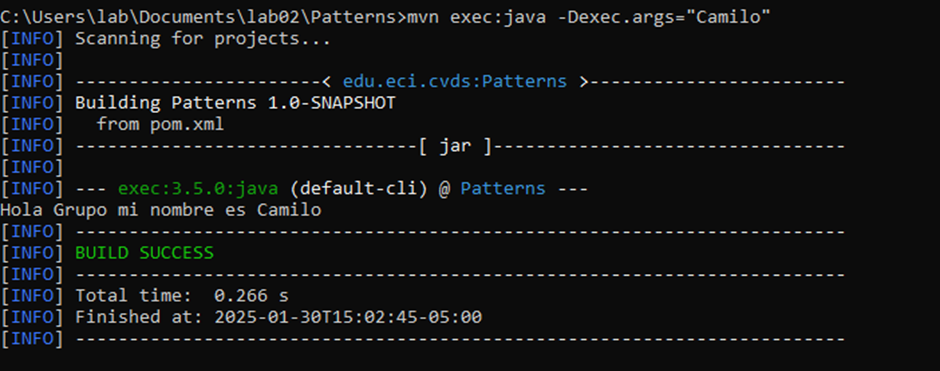

13. Ejecutar la clase desde línea de comandos enviando su nombre como parámetro y verificar la salida. Ej: Hello Pepito!

    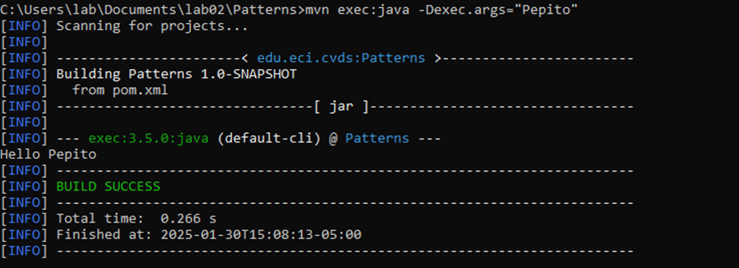

14. Ejecutar la clase con su nombre y apellido como parámetro. ¿Qué sucedió?

    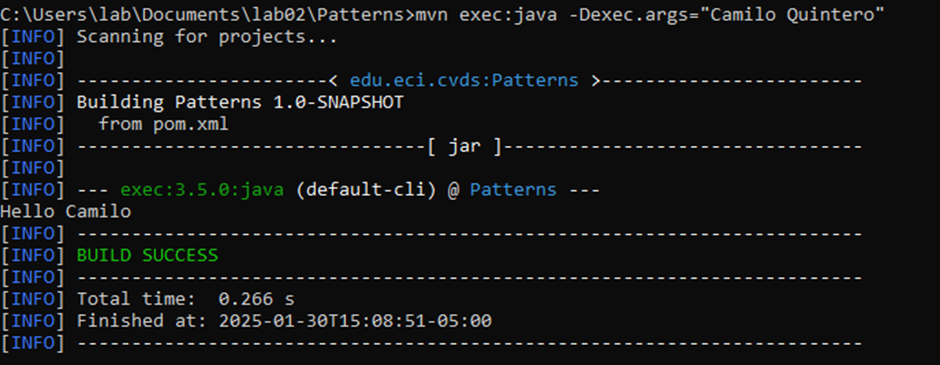

- Lo que sucedió fue que únicamente me tomo el primer párametro, en este caso "Camilo"

15. Verifique cómo enviar los parámetros de forma "compuesta" para que el saludo se realice con nombre y apellido.

- Código modificado:

    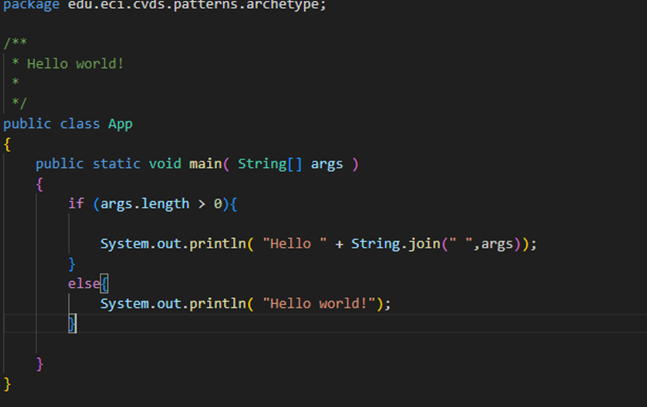

- Resultado:

    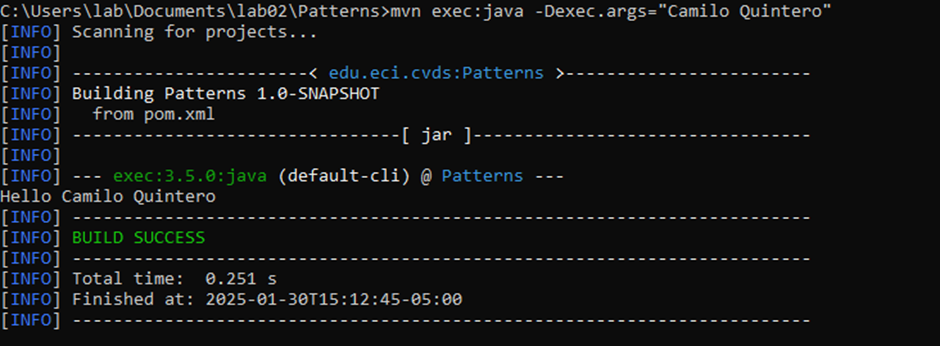

16. Ejecutar nuevamente y verificar la salida en consola. Ej: Hello Pepito Perez!

- Resultado: 

    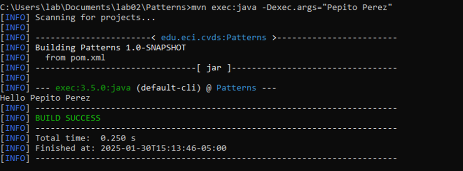

**HACER EL ESQUELETO DE LA APLICACIÓN**

17. Cree el paquete edu.eci.cvds.patterns.shapes y el paquete edu.eci.cvds.patterns.shapes.concrete.

    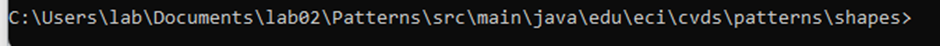
    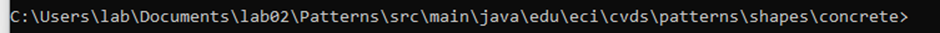

18. Cree una interfaz llamada Shape.java en el directorio src/main/java/edu/eci/cvds/patterns/shapes de la siguiente manera:

    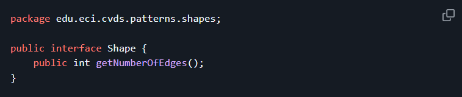

19. Cree una enumeración llamada RegularShapeType.java en el directorio src/main/java/edu/eci/cvds/patterns/shapes así:

    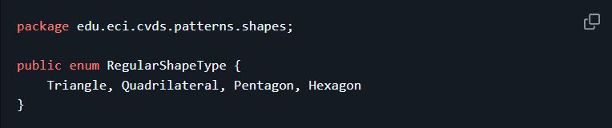

- Se verá de la siguiente manera:

    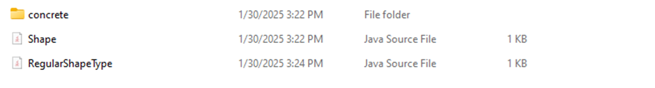

20. En el directorio src/main/java/edu/eci/cvds/patterns/shapes/concrete cree las diferentes clases (Triangle, Quadrilateral, Pentagon, Hexagon), que implementen la interfaz creada y retornen el número correspondiente de vértices que tiene la figura.

- Triángulo:

    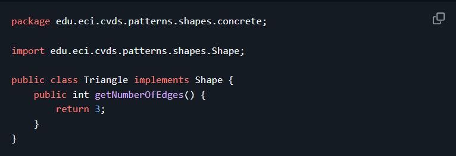

- Cuadrilátero:

    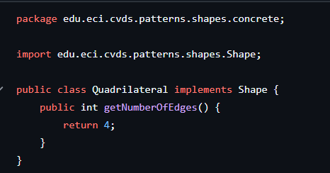

- Pentágono:

    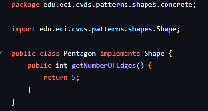

- Hexágono:

    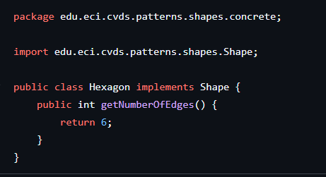

- Verificamos que efectivamente se crearon las clases:

    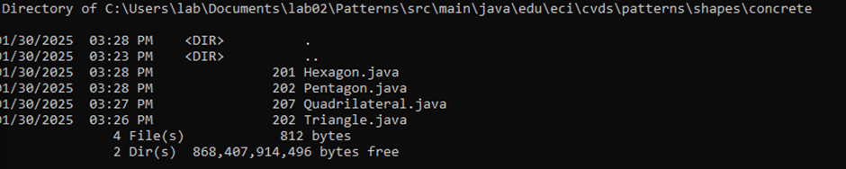

21. Cree el archivo ShapeMain.java en el directorio src/main/java/edu/eci/cvds/patterns/shapes con el metodo main:

    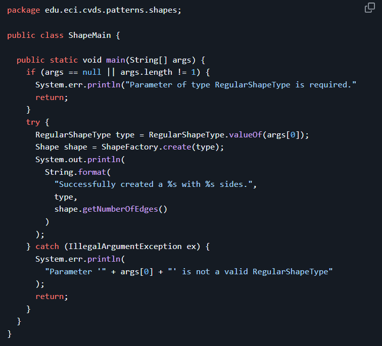

- Verificamos la creación:

    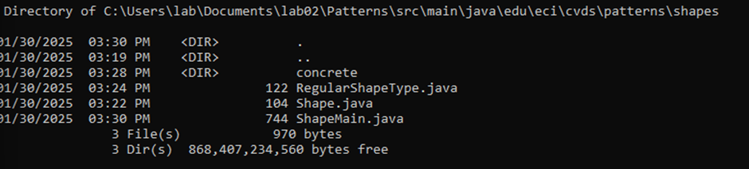

22. Analice y asegúrese de entender cada una de las instrucciones que se encuentran en todas las clases que se crearon anteriormente. Cree el archivo ShapeFactory.java en el directorio src/main/java/edu/eci/cvds/patterns/shapes implementando el patrón fábrica (Hint: https://refactoring.guru/design-patterns/catalog), haciendo uso de la instrucción switch-case de Java y usando las enumeraciones.

    ¿Cuál fábrica hiciste? y ¿Cuál es mejor?

- Nosotros implementamos el patrón de diseño simple factory, de la siguientye manera:
    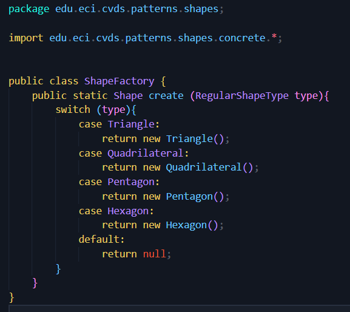

    Sabemos que el código se ve bastante limpio y fácil de entender, además de eso permite el principio O de S.O.L.I.D puesto que si necesitamos más figuras esta abierto a modificación.